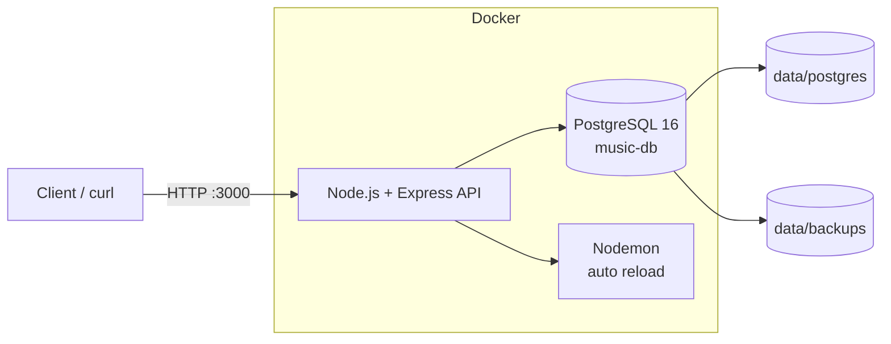
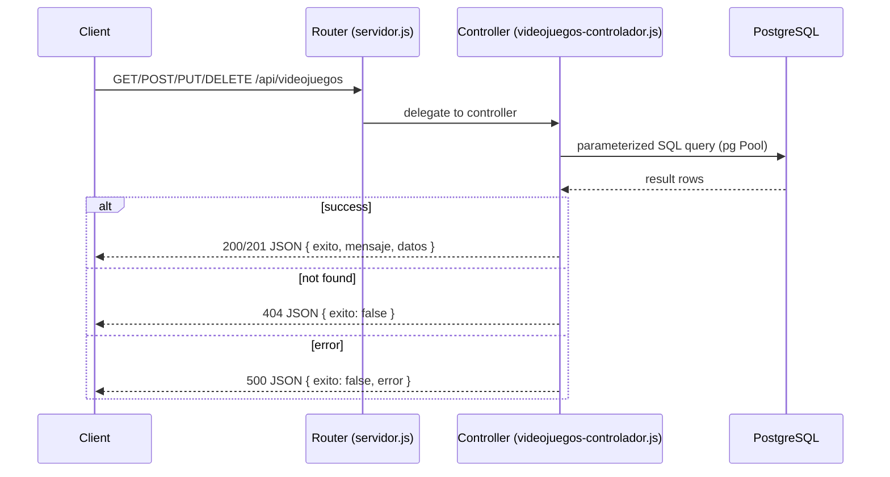
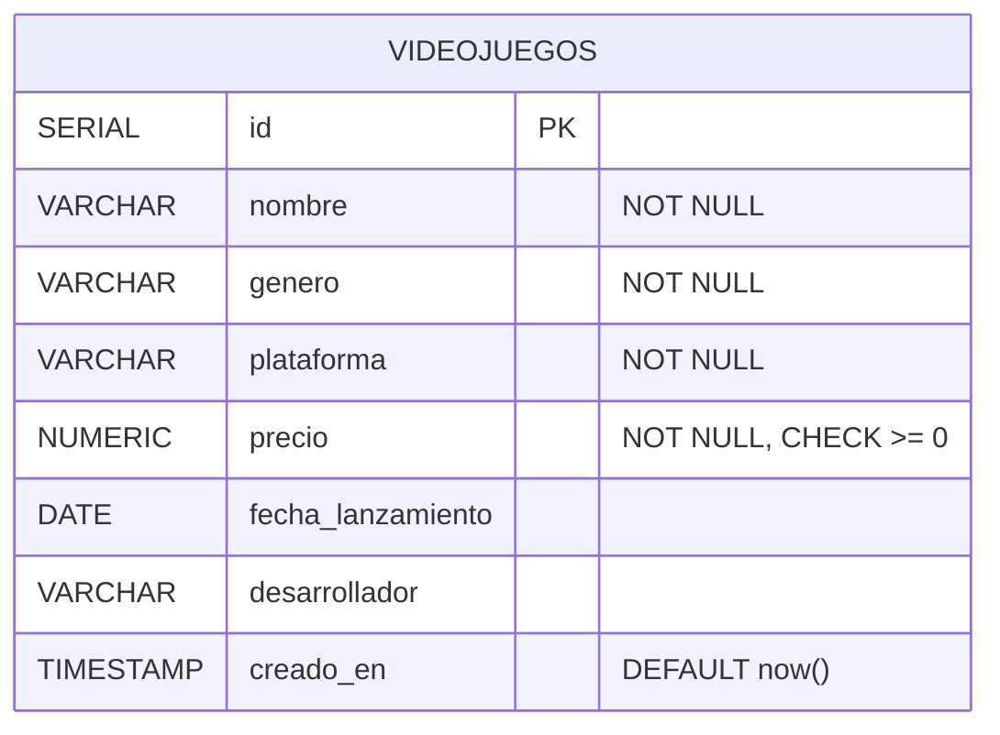
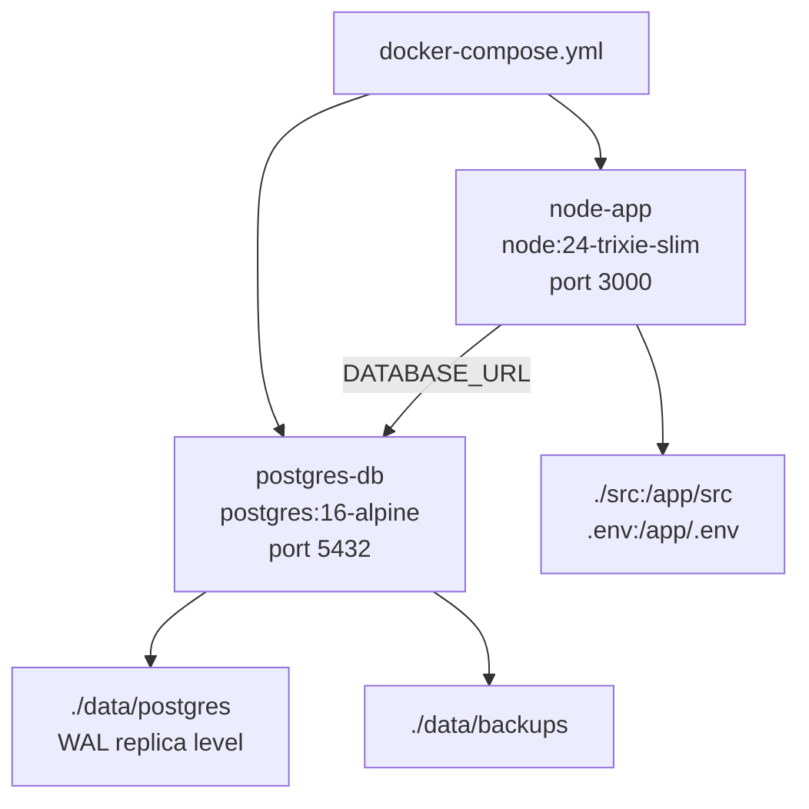

# pg-node - Video Games API

REST API for video games built with Node.js, Express and PostgreSQL.

## Table of Contents

- [Architecture](#architecture)
- [Requirements](#requirements)
- [Configuration](#configuration)
- [Getting Started](#getting-started)
- [Database](#database)
- [Endpoints](#endpoints)
- [Project Structure](#project-structure)

## Architecture

### System Overview



### Request Flow



### Database Schema



### Docker Services



## Requirements

- [Docker](https://www.docker.com/) and Docker Compose
- Node.js 18+ (optional, to run outside Docker)

## Configuration

1. Copy the environment variables file:

```bash
cp .env.example .env
```

2. Edit `.env` with your PostgreSQL credentials.

## Getting Started

### With Docker Compose (recommended)

```bash
docker compose up -d
```

This starts two containers:

- `postgres-db`: PostgreSQL 16 (with WAL configured for backups)
- `node-app`: Express API with nodemon (hot reload)

The API will be available at `http://localhost:3000`.

### Without Docker

```bash
npm install
npm run dev
```

Requires a running PostgreSQL instance and credentials configured in `.env`.

## Database

The `videojuegos` table is created manually. SQL scripts are located in the [`SQL/`](SQL/) folder:

| File | Description |
|---|---|
| `SQL/crear_tablas.sql` | Creates the `videojuegos` table |
| `SQL/insertar_datos.sql` | Inserts sample data |

Run them inside the `music-db` database:

```bash
docker exec -i postgres-db psql -U postgres -d music-db < SQL/crear_tablas.sql
docker exec -i postgres-db psql -U postgres -d music-db < SQL/insertar_datos.sql
```

## Endpoints

| Method | Route | Description |
|---|---|---|
| `GET` | `/` | Server status |
| `GET` | `/api/videojuegos` | Get all video games |
| `GET` | `/api/videojuegos/:id` | Get a video game by ID |
| `POST` | `/api/videojuegos` | Create a video game |
| `PUT` | `/api/videojuegos/:id` | Update a video game |
| `DELETE` | `/api/videojuegos/:id` | Delete a video game |

### Example request

```bash
# Create a video game
curl -X POST http://localhost:3000/api/videojuegos \
  -H "Content-Type: application/json" \
  -d '{
    "nombre": "Hollow Knight",
    "genero": "Metroidvania",
    "plataforma": "PC",
    "precio": 14.99,
    "fecha_lanzamiento": "2017-02-24",
    "desarrollador": "Team Cherry"
  }'
```

### Response structure

```json
{
  "exito": true,
  "mensaje": "videojuegos obtenidos correctamente",
  "total": 10,
  "datos": []
}
```

## Project Structure

```
├── SQL/                        # Database scripts
│   ├── crear_tablas.sql
│   └── insertar_datos.sql
├── src/
│   ├── servidor.js             # Entry point, routes
│   ├── database.js             # PostgreSQL connection pool
│   └── controladores/
│       └── videojuegos-controlador.js
├── docker-compose.yml
├── .env.example
└── package.json
```
